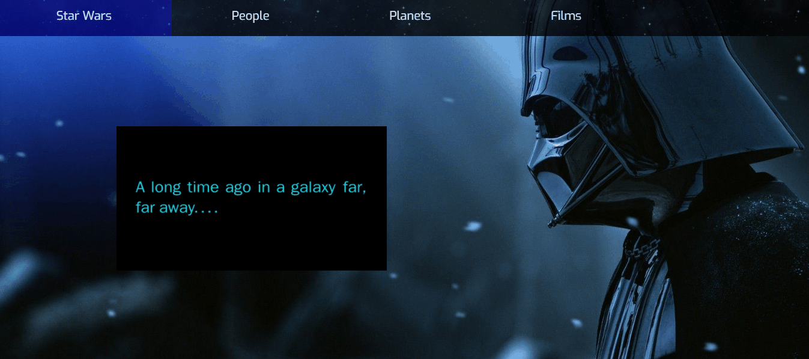

# Star Wars Application with React Router

### Assignment 2 for Advanced Web Development class at OSU instructed by professor R. Hess (2020).
The goal of this assignment is to use React Router to create a moderately complex, multi-page application based on simulated application data.
Follow the link to see the website: https://matyevaa.github.io/star-wars/ or see the demo below:



# Application features

In addition to the application code, there's also a directory of simulated application data in `src/data/`.  This data is derived from the [Star Wars API](https://swapi.dev/) (which is missing some movies, unfortunately) and represents typical data you might build a web application around.  The data is in JSON format (which can be directly `import`ed via Webpack) and is split into three different categories:
  * People (`people.json`)
  * Planets (`planets.json`)
  * Films (`films.json`)

Each of the data files has the same overall structure, though the individual data elements in each file contains slightly different fields that are relevant to the specific kind of data.  For example, elements in `people.json` have fields like `name`, `height`, `mass`, etc., while elements in `films.json` have fields like `title`, `opening_crawl`, `director`, etc.  Take a minute to familiarize yourself with the format of each kind of data element because you will have to implement components to display each kind of data.

Your job for this assignment is to develop an app that lets you explore this data.  The app will have three main "pages", one for each kind of data.  On each of these pages, the user will be able to select one specific item from the corresponding collection of data to see more details about that item.

The application you write should contain three main structural elements, each of which is described below.  Importantly, you must use React Router to implement the application's navigational features.

## Navbar

The navbar should span the top of the application and should contain four things: a site title that links to the application's homepage (i.e. the root URL path, `/`), and three links to navigate to each of the "people", "planets", and "films" pages.  The link corresponding to the page that's currently "active" should be highlighted.

## Sidebar

The sidebar should be positioned along the left side of the page and should contain a list of all of the  elements in the data category corresponding to the "active" link in the navbar.  In other words, if the user clicks the "people" link in the navbar, then a list of all of the characters from `people.json` should appear in the sidebar.  The data elements in the sidebar should be listed by name/title, as appropriate.

Each data element in the sidebar should be a link that functions as described below.  As with the navbar, the "active" sidebar link should be highlighted.

If you can, try to implement the sidebar in such a way that it can be scrolled independently of the rest of the page.

## Main content pane

The main content pane should be positioned at the center of the application.  It should occupy all of the viewport space not occupied by the navbar or the sidebar.  When the user clicks on one of the sidebar links, a detailed view of the corresponding data element should be displayed in the main content pane.  This detailed view should display all data fields for the corresponding data element.  With this in mind, it probably makes sense to implement a separate component to display each different type of data.

For all data types, any data fields that hold an array should be rendered as an unordered list, and any data fields that refer to other data elements should be rendered as links to those elements.  For example, a person's `homeworld` field should be rendered as a link to the corresponding planet, and a film's `characters` field should be rendered as an unordered list of links to the corresponding people.

If no element from the sidebar is "active" (e.g. when the user first clicks a link in the navbar), then the main content pane should either be empty, or it should contain some simple text related to the "active" navbar link.

## Other details

If the user navigates to the root URL path (i.e. `/`, the application's "homepage") you should do either one of two things:
  * Redirect to a link corresponding to one of the three data categories (e.g. `/people`).  You should not redirect to a specific data element, only to a data category (i.e. this redirect should not result in a specific data element being displayed in the main content pane).
  * Display a simple page with some basic text about the application.  This page should *NOT* display the sidebar, but it *should* still have the navbar.

In addition, you should implement a very basic 404 page to handle any URLs that don't correspond to pages in your application.  The 404 page should also *NOT* display the sidebar, but it should still have the navbar.

## Application styling

To accomplish some of the layout required in the description above, CSS code has been written for this application.

## Working with this code

This project was bootstrapped with [Create React App](https://github.com/facebook/create-react-app).
Before running this app for the first time, make sure to run `npm install` to install needed dependencies. Then, to run the app and see it in your browser, you can run
```
npm start
```
This will run the app in the development mode, and it should automatically open [http://localhost:3000](http://localhost:3000) to view the app in your browser (though you can manually open that URL in your browser, too).
